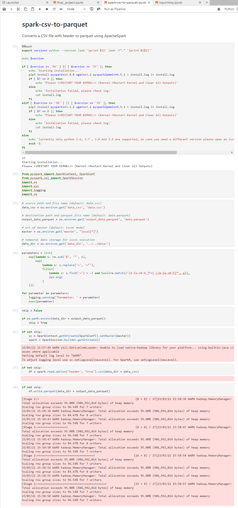
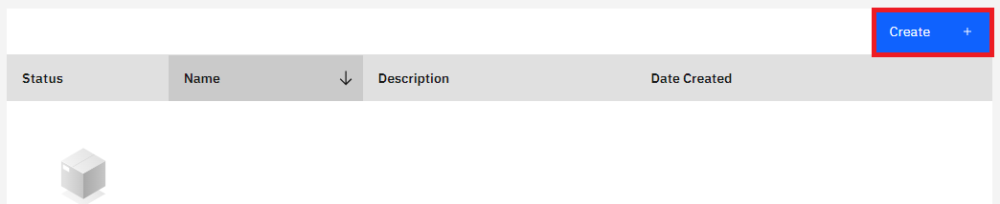

<center>


# ETL and Machine Learning - Project

</center>

##  Indroduction

In this Project, We imported data from an external dataset and create a DataFrame. We saved the data to a Parquet file and follow the steps to train the module using with Apache Spark. We completed the project by deploying the model to the IBM Watson Machine Learning (WML) Service. IBM WML is a scalable, scale-to-zero cloud service that supports training and serving of machine learning and deep learning models, providing a HTTP(S) endpoint for seamless consumption from third-party applications.

##  Objectives

After completing this Project, we were able to:

> 1. Pull-in data from the HMP dataset
> 2. Create a Spark data frame from the raw data
> 3. Store this to parquet (in Cloud Object Store)
> 4. Read it again (from Cloud Object Store)
> 5. Deploy this model to Train a ML-Model on that data set
> 6. Watson Machine Learning

## 📥 1. Import the CLAIMED library


### Open the CLAIMED component library
[GitHub Link](https://github.com/IBM/claimed)

### Click on fork
This way you will be able work on your own copy

###  Load data by using --git--clone
Something like: https://github.com/Ahmed-Abdo-Amin/component-library.git


```python
try:
    !git clone https://github.com/Ahmed-Abdo-Amin/component-library.git
    print('Successfully cloned')
except:
    print('Error: There is a problem in downloading data.')
```

    Successfully cloned
    

    Cloning into 'component-library'...
    Updating files:  70% (308/434)
    Updating files:  71% (309/434)
    Updating files:  72% (313/434)
    Updating files:  73% (317/434)
    Updating files:  74% (322/434)
    Updating files:  75% (326/434)
    Updating files:  76% (330/434)
    Updating files:  77% (335/434)
    Updating files:  78% (339/434)
    Updating files:  79% (343/434)
    Updating files:  80% (348/434)
    Updating files:  81% (352/434)
    Updating files:  82% (356/434)
    Updating files:  83% (361/434)
    Updating files:  84% (365/434)
    Updating files:  85% (369/434)
    Updating files:  86% (374/434)
    Updating files:  87% (378/434)
    Updating files:  88% (382/434)
    Updating files:  89% (387/434)
    Updating files:  90% (391/434)
    Updating files:  91% (395/434)
    Updating files:  92% (400/434)
    Updating files:  93% (404/434)
    Updating files:  94% (408/434)
    Updating files:  95% (413/434)
    Updating files:  96% (417/434)
    Updating files:  97% (421/434)
    Updating files:  98% (426/434)
    Updating files:  99% (430/434)
    Updating files: 100% (434/434)
    Updating files: 100% (434/434), done.
    

##  2. Explore the CLAIMED component library
<hr/>
<br/>

1. Go to the folder <strong>"claimed"</strong> double-click on it, then on <strong>“component-library”</strong>

2. Open the folder called "transform" and open the notebook called <strong>spark-csv-to-parquet</strong>.
3. run the <strong> spark-parquet-to-csv</strong>notebook

<strong>Note:</strong> this notebook will fail in the penultimate cell with AnalysisException: 'Path does not exist: file:/resources/claimed/data/data.csv;' - this is because we haven't created any data yet.


## 3. Create the Pipeline

 
 pulling the the HMP data set. In the component library under folder “input” (so in claimed/component-library/input) you’ll find a notebook called “input-hmp.ipynb”. Just open it by double-clicking and execute each cell, one by one until you get the result file.


 use the spark-csv-to-parquet notebook in the transform category you’re already familiar with. The writing speed of parquet is far higher than the one of CSV files, this is already a glimpse of the effectiveness of the parquet format.



##  4. Perform Model Training
<hr/>

1. open the spark-train-lr.ipynb notebook in the “train” category
2. use the default values and train a linear regression model using the data
3. Explore a file called model.xml in the “data” folder PMML stand for “Predictive Model Markup Language” and is an interchange format for machine learning models. We’ll use this file to deploy to the IBM Watson Machine Learning Service in the next section.


## 5. Complete the Model Training
Show the xml file.
<hr/>


##   6. Deploy the Model
<hr/>

To use the service an API_KEY and DEPLOYMENT_SPACE_GUID is needed. The API_KEY provides access to all IBM Cloud services whereas the DEPLOYMENT_SPACE_GUID is used to publish the model to the Watson Machine Learning service. 

1. An IBM Cloud account needs to be created and activated
2. An Instance of IBM Cloud Pak for Data needs to be starte
3. Within that, a Deployment Space needs to be created


and a Watson Machine Learning Service needs to be created and associated to the Deployment Space. 

###  6.1 Create and Obtain API keys
<hr/>

1. Open [the IBM Cloud Registration Page](https://dataplatform.cloud.ibm.com/registration/stepone?utm_medium=Exinfluencer&utm_source=Exinfluencer&utm_content=000026UJ&utm_term=10006555&utm_id=NA-SkillsNetwork-Channel-SkillsNetworkCoursesIBMBD0231ENSkillsNetwork866-2023-01-01) in your web browser.
2. Select “Dallas” (1) as IBM Cloud location.


<br/>
3. If you already have an IBM Cloud account, complete the activation steps, otherwise please create a new account

Click and open this [link](https://cf-courses-data.s3.us.cloud-object-storage.appdomain.cloud/IBM-CC0100EN-SkillsNetwork/labs/IBMCloud_accountCreation/CreateIBMCloudAccount.md.html) and follow the instructions, to create an IBM Cloud account. Once completed, open the[IBM Cloud login page](https://dataplatform.cloud.ibm.com/?utm_medium=Exinfluencer&utm_source=Exinfluencer&utm_content=000026UJ&utm_term=10006555&utm_id=NA-SkillsNetwork-Channel-SkillsNetworkCoursesIBMBD0231ENSkillsNetwork866-2023-01-01) and select “Dallas” as cloud region.


4. Click “Deployments” (1).


5. Create a new deployment space.
6. Enter “think” as name (1) and click “Create” (2).

7. Wait for the deployment space to be created.
8. Click “View new space” (1).

9. Select the “Manage” tab and locate the “Machine learning service” section.

10. Click “Associate instance +” (1) to add Watson Machine Learning to the space.

11. Select the free “Lite” (1) plan and click “Create” (2) if no existing Watson Machine Learning service was found.

12. Select the Machine Learning service instance you’ve just created. Note that the name might be slightly different in your environment.

13. Make sure you’re still on the “Manage” (1) tab and then click the copy button for the DEPLOYMENT_SPACE_GUID (2). (Note that highlighting and copying the ID doesn’t work because only a portion is displayed.)

14. Paste the copied space ID into a file for later use.
  (Create an IBM Cloud API key)

15. Open the [Cloud API key page[(https://cloud.ibm.com/iam/apikeys?utm_medium=Exinfluencer&utm_source=Exinfluencer&utm_content=000026UJ&utm_term=10006555&utm_id=NA-SkillsNetwork-Channel-SkillsNetworkCoursesIBMBD0231ENSkillsNetwork866-2023-01-01).

16. Click “Create an IBM Cloud API key”.


17. Name the API key “think” (1) and click “Create” (2).


18. Copy the API_KEY to your clipboard and paste it to the text editor which already contains the DEPLOYMENT_SPACE_GUID.

### 6.2 Deploy The Trained Model
<hr/>

1. Open the “deploy/deploy_wml_pmml” component and fill in the API_KEY and DEPLOYMENT_SPACE_GUID
2. Run all cells

<br/>

3. Open the [ML runtime spaces page](https://dataplatform.cloud.ibm.com/ml-runtime/spaces?utm_medium=Exinfluencer&utm_source=Exinfluencer&utm_content=000026UJ&utm_term=10006555&utm_id=NA-SkillsNetwork-Channel-SkillsNetworkCoursesIBMBD0231ENSkillsNetwork866-2023-01-01)
4. Select your space
5. Identify your model (1) and click on the “rocket” symbol (2) to deploy your model


6. Select “Online”, give it a name and click on “Create”

7. Click on “Deployments”, then identify your deployment and click on it.

8. Click on “Python” to obtain sample code on how to call your model
9. Copy the complete python sample code into a jupyter notebook


10. Paste the IBM Cloud API_KEY from the last section to the appropriate location in the code

11. Replace the line starting with with the following line:

>> payload_scoring = {"input_data": [{"fields": ["x", "y", "z", ], "values": [[1,2,3]]}]}

12. Execute the code. You should see the result of the prediction


### 6.3. Deploy the model to Watson Machine Learning


## 7. Perform Model Inference


##

## 8. HyperParameter Tuning

<hr/>

- Iterate over the hyperparameters maxIter in [10, 100, 1000], regParam in [0.01, 0.5, 2.0] and elasticNetParam in [0.0, 0.5, 1.0].
- Print the accuracy for each combination of hyperparameters in a human readable format.
- Report the combination of hyperparameters that yielded the highest accuracy


##   9.  Resample data splits
<hr/>

- 70:30 train:test split
- 90:10 train:test split

Note: for both the splits above, use a random seed of 1.


##  10. RandomForest classification


```python

```
